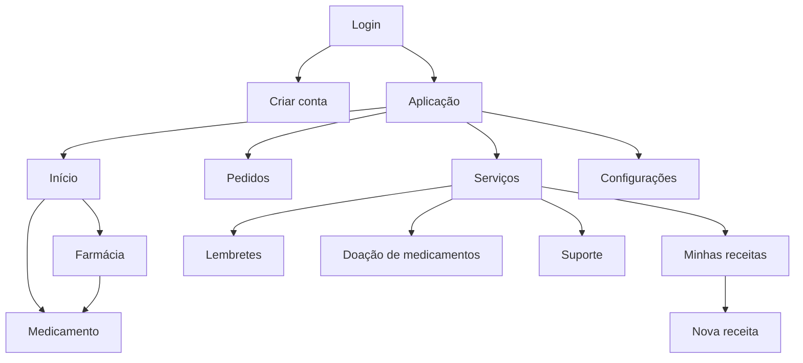

# FarmaFast

Aplicativo multiplataforma em Flutter para explorar uma experiência digital de farmácia: descoberta de produtos e farmácias, pedidos, receitas, lembretes e doação de medicamentos.

> **Status:** protótipo de produto / portfólio. Os dados exibidos são demonstrativos e o app não substitui orientação médica ou farmacêutica.

## Visão geral

O FarmaFast organiza uma jornada simples em quatro frentes:

- **Início:** busca, banners, farmácias em destaque e produtos.
- **Pedidos:** histórico demonstrativo de compras.
- **Serviços:** receitas, lembretes, doações e suporte.
- **Conta:** preferências locais, notificações e tema.

A aplicação usa Flutter e mantém targets para Android, iOS, Web, Windows, macOS e Linux.

## Executar sem emulador

### Opção 1 — navegador

A maneira mais direta de testar a interface sem Android Studio ou emulador é pelo Chrome:

```bash
flutter pub get
flutter run -d chrome
```

Para gerar uma versão estática:

```bash
flutter build web
```

O resultado fica em `build/web` e pode ser servido por qualquer servidor HTTP estático.

### Opção 2 — Windows

Em um computador Windows com o suporte desktop do Flutter configurado:

```bash
flutter config --enable-windows-desktop
flutter pub get
flutter run -d windows
```

Para gerar o executável:

```bash
flutter build windows --release
```

O bundle final fica em `build/windows/x64/runner/Release/`. Distribua a pasta inteira, não apenas o arquivo `.exe`, porque o runner depende das DLLs e assets gerados pelo Flutter.

> Alguns plugins do projeto são orientados a recursos móveis. Fluxos ligados a câmera, alarmes em background e notificações precisam ser validados por plataforma antes de serem considerados prontos para produção.

## Estrutura principal

```text
lib/
├── main.dart
├── my_app.dart
├── buttons/
├── classes/
├── pages/
│   ├── login_page.dart
│   ├── general_page.dart
│   ├── home_page.dart
│   ├── pedidos_page.dart
│   ├── servicos_page.dart
│   ├── receita_page.dart
│   ├── alarmes_page.dart
│   ├── doacoes_page.dart
│   └── ...
└── repositories/
```

## Fluxo de telas



## Stack

- Flutter / Dart
- Material
- GetX para navegação existente
- Provider para estado de receitas
- Shared Preferences para preferências locais
- Intl para datas
- Plugins de câmera, imagem, notificações e áudio

## Melhorias recomendadas para produção

O repositório ainda contém comportamento demonstrativo. Antes de publicar como produto real, trate autenticação, backend, catálogo e estoque reais, pagamentos, consentimento e privacidade, segurança de dados, acessibilidade, observabilidade e testes por plataforma.

Também é importante revisar regras regulatórias e de negócio para venda e dispensação de medicamentos, especialmente produtos sujeitos a prescrição.

## Desenvolvimento

```bash
flutter pub get
flutter analyze
flutter test
```

## Licença

Nenhuma licença foi declarada neste repositório até o momento. Defina uma licença antes de permitir reutilização externa do código.
